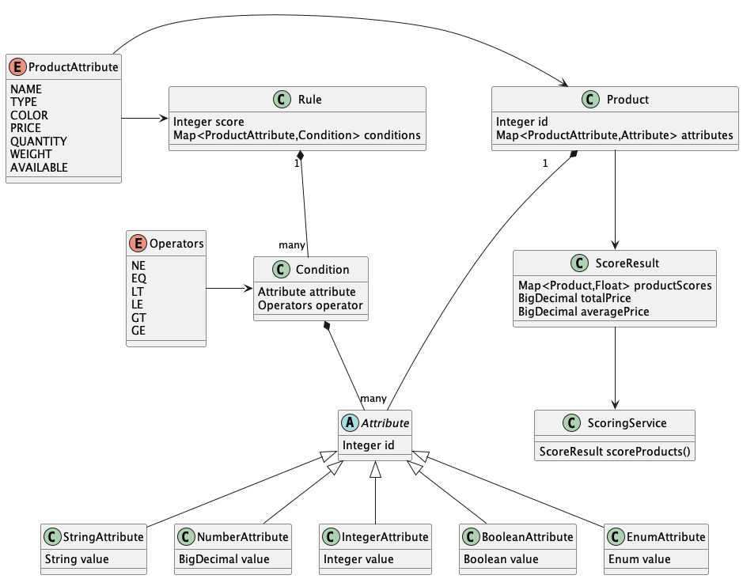

# ConextLabs Home assignment

## UML diagram

Created with PlantUML (prefer to write as a code, instead of drawing)


Source: `class-diagram.puml` 




Note: this is a limited representation of the classes

## Product score calculator method

Extract from: contextlabs.service.ScoringService

```
	private Float calculateScore(Product product, List<Rule> rules) {
		float totalScore = ZERO_SCORE;
		for (Rule rule: rules) {
			int totalConditionCount = 0;
			int matchedConditionCount = 0;
			for (ProductAttributes condAttr: rule.getConditions().keySet()) {
				Attribute<? extends Serializable> prodAttr = product.getAttributes().get(condAttr);
				if (prodAttr != null) {
					for (Condition condition: rule.getConditions().get(condAttr)) {
						totalConditionCount++;
						if (prodAttr.evaluate(condition.getAttribute(), condition.getOperator())) {
							matchedConditionCount++;
						}
					}
				} else {
					totalConditionCount += rule.getConditions().get(condAttr).size();
				}
			}
			if (matchedConditionCount > 0) {
				float scorePrecent = (float)matchedConditionCount / totalConditionCount;
				if (this.singleRuleScoreThreshold < scorePrecent) {
					totalScore += (float)rule.getScore() * scorePrecent;
				}
			}
		}
		return totalScore;
	}
```

## Assumptions

- each item is considered as different product (e.g does not merge any products with same data)
- only AND operator allowed between the rule conditions

## Build

Note: Java 17 required

The project uses maven for dependency management and build. Maven wrapper added to the project, no need to install it.

`./mvnw clean package spring-boot:repackage`

## Run

Note: Java 17 required

Build first with `./mvnw clean package spring-boot:repackage`

### With built in data set and default parameters

`java -jar ./target/homework-0.0.1-SNAPSHOT.jar`

### With custom product data, rules and thresholds

`java -jar ./target/homework-0.0.1-SNAPSHOT.jar --products-csv=/path/to/products-csv --rules-file=/path/to/rules-file --product-score-threshold=200 --single-rule-score-threshold-precent=25`


## File formats

### Products CSV

- first row is the header (column names must match - case insensitive - with the fields defined in the ProductAttributes enum)
- column order does not matter

Sample

```
"Name","Type","Color","Price","Quantity","Weight","Available"
"ProdOne","Furniture","RED","20.4","12","20","true"
"ProdTwo","Tools","WHITE","50","150","1","true"
```

### Rules file

- each line single rule with one or more condition and the score value for complete match of the rule

Sample

```
color == BLUE && price < 17.75 && quantity > 750 -> 100
quantity > 1000 -> -10
```

## TODO

- way more tests, just added basic ones (separate unit test from integration tests)
- improved code comments and documentation
- validation
- add logging
- configure parallel execution of scoring (the code is prepared for concurrency, but not tested so may have flaws)
- better error handling, for cases like unsupported fields/values conditions
- reactive CSV parser
- non blocking rule loading

